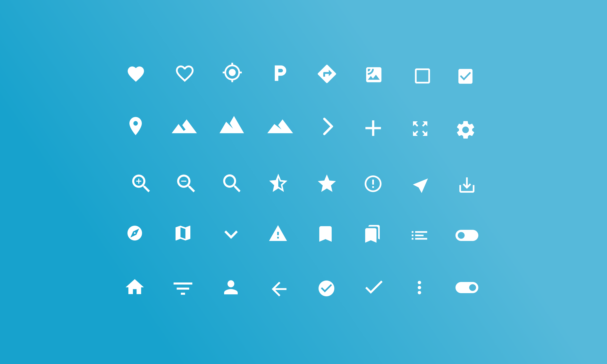

### ТЗ
Тестовое задание состоит из двух частей:

Часть 1: Создание сайта визитки с использованием свободного контета на Next.js

1. Используйте Nextjs для создания сайта-визитки.
2. Добавьте глобальный прелоудер (loading.tsx) для основных
страниц.
3. Создайте две группы страниц (сгруппируйте их с помощью возможностей
Nextjs):
 - - Обычные страницы с текстовым контентом.
 - - Страницы с SideBar'ом слева для перехода на разные разделы.

Часть 2: Реализация авторизации с использованием JWT и Next Auth
1. Настройте авторизацию с использованием JWT-токена.
2. Используйте Next Auth для реализации авторизации.
3. Для получения JWT-токена настройте и используйте
любое OpenAPI для тестов.
4. Создайте кастомную страницу с формой авторизации.
- - Используйте дизайн формы по ссылке: http://christianboe.com/wp-content/uploads/2018/11/desktop-frame-1.jpg.
- -  Фон страницы можно сделать однотонным.
- - Все оформление в свободной форме
5. Используйте TypeScript при написании кода.

Требования к выполнению задания:
- Перед началом выполнения задания напишите в Telegram (@taskaevav) о готовности и укажите
сроки выполнения (не более 3 дней).
- После завершения задания запишите видео экрана с короткими комментариями по коду и
результату работы.
- Отправьте видео и ссылку на код в Telegram (@taskaevav).
Дополнительно:
- Если у вас есть идеи, которые могут стать конкурентным преимуществом, напишите об этом Telegram.

### Референсы
- https://christianboe.com/portfolio/skybound/

